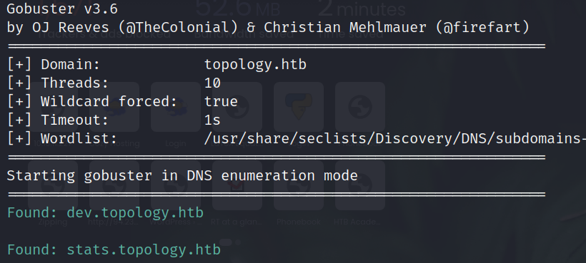
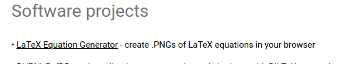
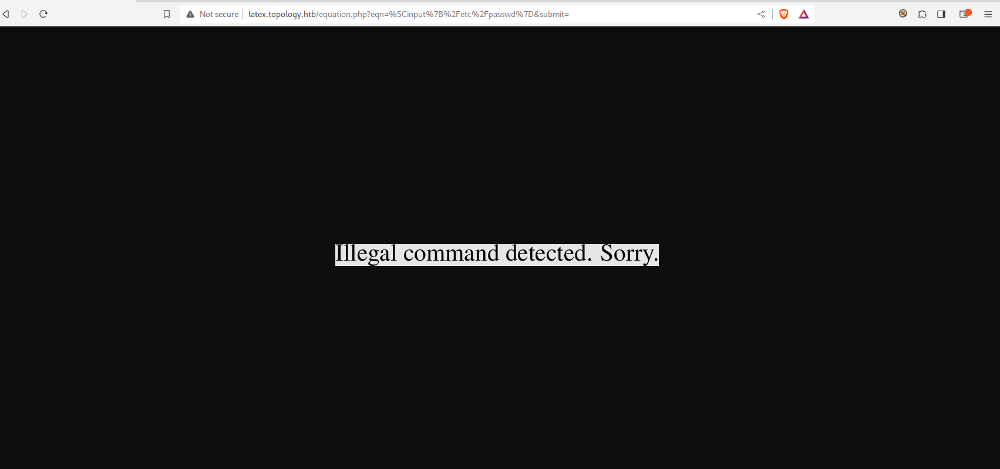
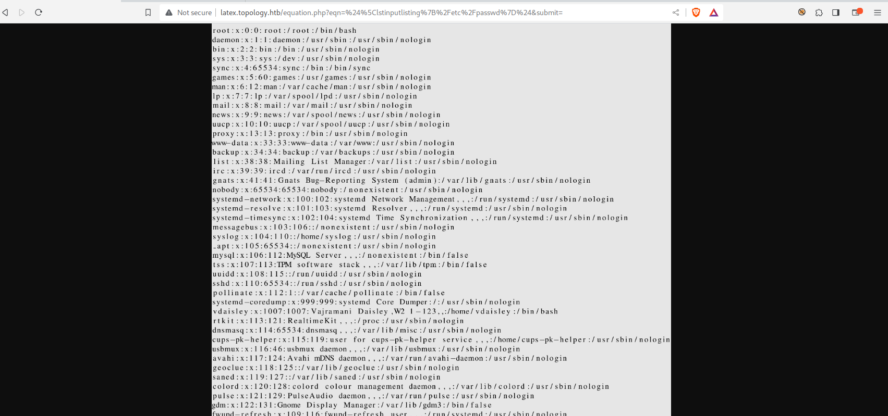
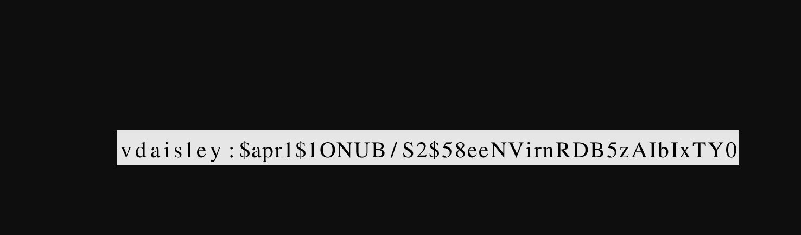
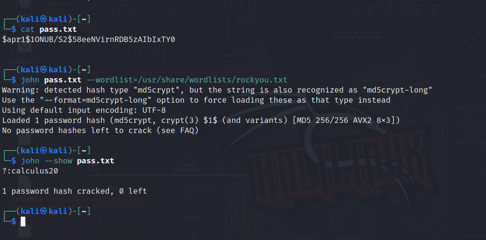
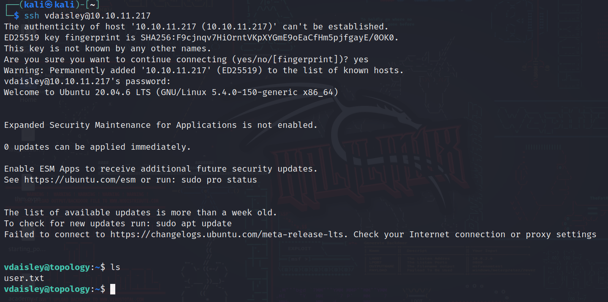
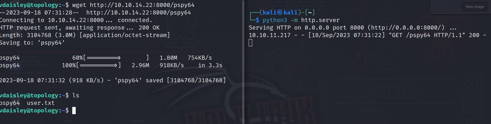
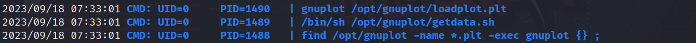
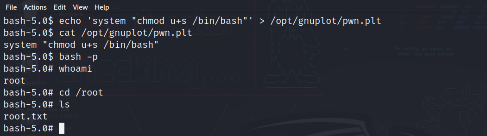

# Topology machine on [hackthebox](./images/https://app.hackthebox.com)

Written by: Mustafa Musallati.

---

### Enumeration:


nmap scan result:
```
Starting Nmap 7.94 ( https://nmap.org ) at 2023-09-17 04:55 EDT
Warning: 10.10.11.217 giving up on port because retransmission cap hit (6).
Nmap scan report for 10.10.11.217
Host is up (0.15s latency).
Not shown: 997 closed tcp ports (conn-refused)
PORT     STATE    SERVICE     VERSION
22/tcp   open     ssh         OpenSSH 8.2p1 Ubuntu 4ubuntu0.7 (Ubuntu Linux; protocol 2.0)
| ssh-hostkey: 
|   3072 dc:bc:32:86:e8:e8:45:78:10:bc:2b:5d:bf:0f:55:c6 (RSA)
|   256 d9:f3:39:69:2c:6c:27:f1:a9:2d:50:6c:a7:9f:1c:33 (ECDSA)
|_  256 4c:a6:50:75:d0:93:4f:9c:4a:1b:89:0a:7a:27:08:d7 (ED25519)
80/tcp   open     http        Apache httpd 2.4.41 ((Ubuntu))
|_http-title: Miskatonic University | Topology Group
|_http-server-header: Apache/2.4.41 (Ubuntu)
8181/tcp filtered intermapper
Service Info: OS: Linux; CPE: cpe:/o:linux:linux_kernel

Service detection performed. Please report any incorrect results at https://nmap.org/submit/ .
Nmap done: 1 IP address (1 host up) scanned in 36.66 seconds
```

So two ports open, 22 ssh and 80 http.....
Let's check the website:


So we have some sort of web page of a group in an university.


If we do some subdomain enumeration too we will find the following:



Let's add them to /etc/hosts file and check them....

```
10.10.11.217    dev.topology.htb
10.10.11.217    stats.topology.htb
```

1) The dev.topology.htb will prompt us for a username and password.
2) the stats.topology.htb will give us a broken image and a chart of stats for the website.


Also we have another website inside which is a project for one of the staff:



Before going to it we need to add it to the /etc/hosts file in our system like this:

```
10.10.11.217    latex.topology.htb
```


We have some sort of equation generator??


We need to understand it, so let's search about it and give it some data and see how does it react.

So what it does, you give it an equation using it's syntax  in order to generate a png for you to use in a website or so.


### Exploitation

Through searching we can find that there is latex commands injection, for example:

```
\input{file name}: to list a file's content.
```

If we tried to read the content of /etc/passwd we will see the following:



So there is a filter or something blocking it, if we searched more we will find different methods to inject a command and read files with latex, such as "lstinputlisting" command.

So let's try the following:
```
$lstinputlisting{/etc/passwd}$
```



It worked!!

Now if you know we can see the passwords for that subdomain we found, in the /var/www/dev/ directory, they are stored in a file called .htpasswd, since that subdomain (dev) had a simple authentication, passwords and usernames usually stored there,
and also /var/www is the root directory for a web server that is running.

```
$\lstinputlisting{/var/www/dev/.htpasswd}$
```



A user called "vdaisley" with a hashed password!

We will use john.

We added the hash into a file called "pass.txt" then did the following:



And here's an easy password "calculus20".

Let's login with ssh:



And finally we have the user flag! Now time for root.

We will use a tool called "pspy", which is used to see the processes and command ran on the system without root permission.

Link on GitHub: [Link.](./images/https://github.com/DominicBreuker/pspy)

We will upload the file on the target system like so:



We will make it executable and execute it.



Here we see an interesting thing in the gnuplot directory, if we checked it, we will see that we can write and execute files in it but cant read, and the root will execute files with the extension .plt in it.

So if we searched for exploits about it, we will see that we can put a file inside it with a command and it will be executed!

so we will do the following:




We added a command that will add a sticky bit on the bash binary and the command will be executed since the file has plt extension,
then we run bash -p to get a bash shell with what we specified and boom it's root.


Thanks for reading!

Good hunting!! :)


---

Written by: Mustafa Musallati.
[LinkedIn](https://www.linkedin.com/in/mustafa-musallati-95a159260/)
[instagram](https://www.instagram.com/accaard/)

